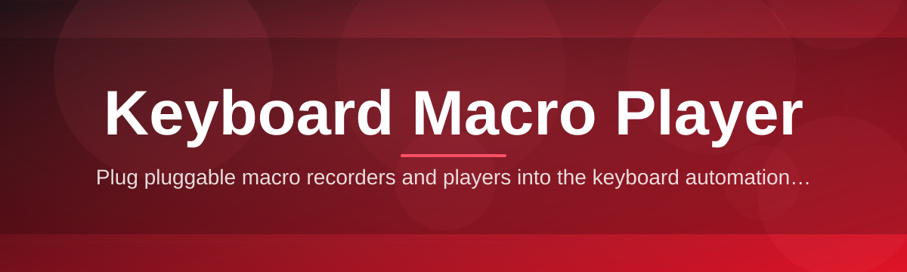
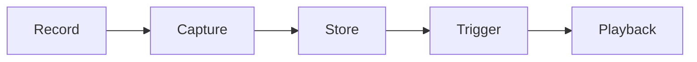

# keyboard-macro-controller ⌨️🎛️

  

*Your keystrokes, recorded once, replayed forever — because typing the same thing twice is a design flaw in the universe.*

  

---

## 🧠 Overview

Let's be honest — most repetitive keyboard work is not "skill," it's just muscle memory doing unpaid overtime. **keyboard-macro-controller** is a Windows desktop app that records real keyboard (and optional mouse) input and plays it back exactly the way you did it — same timing, same rhythm, same everything. It exists because macro tools historically fall into two camps: bloated automation suites that need a PhD to configure, or sketchy one-file tools that vanish after one Windows update. This project tries to be the third option — the one that just works, looks decent, and doesn't ask you to sell your soul for a hotkey.

Under the hood it's a purpose-built **Keyboard Macro Player** — not a general scripting platform pretending to be one. That distinction matters. You're not writing pseudo-code to move a mouse three pixels; you're recording actual input sequences and replaying them with configurable speed, loop counts, and trigger keys. Whether you're a data-entry veteran, a QA engineer running the same test steps for the fortieth time, a gamer who needs consistent macro timing, or a streamer automating scene-switch keystrokes, this tool is built around a single idea: *your time is worth more than repetition.*

It's aimed at people who value control over their own workflow. No cloud account, no telemetry phoning home, no subscription wall. You install it, you record something, you play it back. The rest of this README exists because "just download it" apparently isn't detailed enough for GitHub anymore — so buckle in.

<strong>📖 The origin story (click to expand)</strong>

 

This project started as a personal itch-scratch. The maintainer was doing manual form entry for a job that shall remain nameless, discovered every "macro recorder" on the internet either wanted a license key mailed via carrier pigeon or triggered six antivirus warnings on launch. So — a weekend project was born, then a month, then a community.

By late 2025 it had a UI, a settings panel, hotkey binding, and enough GitHub stars that people started opening issues asking for a roadmap. Here we are in 2026, still recording keystrokes, still refusing to add a login screen.

---

## 🔥 What It Actually Does

> [!TIP]
> Every capability below was built because someone in an issue thread said "it would be nice if..." — this is a community-shaped tool, not a spec-sheet checkbox exercise.

- **Frame-accurate recording** — captures keystrokes and mouse events with millisecond-level timing, so playback feels identical to the original input, not a robotic approximation of it.

- **Custom hotkey binding** — assign any key combination to start, stop, or trigger a specific macro, so you never have to touch the mouse to control playback.

- **Loop and repeat logic** — set a macro to run once, N times, or indefinitely until you say stop — perfect for long-running repetitive keyboard sequences.

- **Variable playback speed** — slow a macro down for precision debugging or speed it up when you just need the result, not the show.

- **Macro chaining** — link multiple recorded sequences into a single execution queue, turning small building blocks into a full automated workflow.

- **Profile-based organization** — group macros into named profiles so your "work" macros and "game" macros never collide.

- **Lightweight footprint** — no background services eating RAM, no installer that also installs three browser toolbars.

- **Portable mode** — run it straight from a folder, no registry footprint, no admin rights demanded for no reason.

---

## 🚀 How To Get Started

1. **Visit the landing page** — click the download button above, it takes you straight to the official project site.

2. **Download the latest build** — grab the current 2026 release for Windows straight from the page.

3. **Run the executable** — no installer wizard, no five "Next" buttons, just launch it.

4. **Record your first macro** — hit the record hotkey, do your thing, hit stop, then bind a playback key. Welcome aboard.

> [!NOTE]
> First launch may take a second longer while Windows Defender SmartScreen does its due diligence on a fresh executable. That's normal — it settles down after the first run.

---

## 💻 System Requirements

| Requirement | Details |
|---|---|
| OS | Windows 10 or Windows 11 (64-bit) |
| Dependencies | None — fully standalone binary |
| Disk space | Under 50 MB |
| Admin rights | Not required for standard use |
| Internet | Not required after download |

> [!IMPORTANT]
> This is a Windows-native tool. There is no macOS or Linux build, and no, running it through a compatibility layer is not officially supported — it might work, it might not, don't file that bug report.

---

## ⚙️ How It Works

The internal flow is intentionally simple — complexity is the enemy of reliability when you're dealing with real-time input capture.

1. **Listener hooks into the OS input stream** and passively watches for keyboard/mouse events without interfering with normal usage.

2. **Recorder timestamps every event** relative to the previous one, building an accurate sequence rather than a flat list of keys.

3. **Sequence gets stored** in a lightweight local macro file, tied to whichever profile is active.

4. **Player reconstructs the timing** and dispatches synthetic input events back into the system exactly as they were captured.

5. **Trigger layer** listens for your assigned hotkeys and starts/stops playback on demand — no manual clicking required.

---

## 🧩 Troubleshooting

<strong>My macro plays back slightly faster/slower than I recorded it — why?</strong>

 

Background CPU load during recording can introduce tiny timing drift. Try closing heavy background apps while recording, or use the playback speed slider to fine-tune the result manually.

<strong>The hotkey I assigned doesn't trigger inside a specific game.</strong>

 

Some games use exclusive fullscreen input capture that blocks global hooks. Try running in borderless windowed mode, or assign a hotkey the game itself doesn't already use.

<strong>Windows SmartScreen flagged the download.</strong>

 

This happens with new or infrequently-downloaded executables lacking a large-scale code-signing reputation yet. Click "More info" then "Run anyway" if you trust the source — which, hopefully, you do, since you're reading this repo.

<strong>Can I run two macros at the same time?</strong>

 

Not simultaneously on overlapping keys — input playback is sequential by design to avoid keystroke collisions. Macro chaining is the supported way to run multiple sequences in order.

<strong>My recorded macro missed a few keystrokes.</strong>

 

This usually means another application intercepted the key before the listener could log it. Try running the app with elevated permissions if the issue persists.

---

## 🎨 UI / UX Details

  

- **Themes** — Light, Dark, and a high-contrast mode for accessibility.

- **Global shortcuts:**

    | Action | Default Key |
    |---|---|
    | Start Recording | `F6` |
    | Stop Recording | `F7` |
    | Play Macro | `F8` |
    | Stop Playback | `Esc` |

- **Settings panel** — adjust playback speed, loop count, hotkey bindings, and startup behavior, all persisted between sessions.

- **Tray icon mode** — minimize to system tray for a zero-clutter desktop presence while macros run in the background.

> [!TIP]
> Rename your macros immediately after recording. "New Macro (3)" will haunt you in six months when you have forty of them.

---

## 🤝 Contributing & Community

This project grows because people actually use it and tell us what's missing — not because of a roadmap dreamed up in isolation.

- **Open an issue** for bugs, timing quirks, or platform edge cases.
- **Start a discussion** if you have an idea but aren't sure it deserves a full issue yet.
- **Submit a pull request** — small, focused changes get reviewed fastest.
- **Check the roadmap** pinned in Discussions for what's currently planned — profile syncing and a scripting hook layer are both on the table for later 2026 builds.

> [!WARNING]
> Please don't submit PRs that turn this into a general-purpose scripting engine. The whole point is that it stays a focused **Keyboard Macro Player**, not a Frankenstein automation suite.

---

## 📜 License

Released under the [MIT License](LICENSE) — 2026. Use it, fork it, build on it, just keep the license notice intact.

---

## ⚠️ Disclaimer

This tool automates keyboard input for legitimate personal productivity, testing, and accessibility purposes. Using it in ways that violate the terms of service of third-party software or platforms is entirely the user's responsibility, not the maintainers'. Use good judgment.

